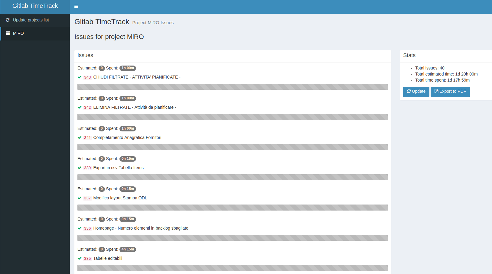

Gitlab TimeTrack 2
==================

A Symfony project to display time track info from Gitlab Projects

Version 2 upgrades symfony and Docker environment



Installation
------------

ALl the project is already configured to work with docker.
First you'll have to check that docker and docker-compose are installed on your system.

Then, you need to copy the `docker-compose.override.yml.dist` to `docker-compose.override.yml.dist` 
and update its values:

* GITLAB_TOKEN: 'YourGitlAbToKeN'
* GITLAB_SERVER_URL: 'https://gitlab.com' 

The gitlab token can be obtained at `https://your.gitlab.server.host/profile/personal_access_tokens`

The first time, you'll need to build the environment, install dependencies and create the DB. There's a convenient
make script that will do al this for you: 

```bash
make install
``` 

After the first time, you'll only need to issue the following command:

```bash
make docker start
```

To have a list of the available commands, just type

```bash
make
```

Head to [http://localhost:8080](http://localhost:8080)

Usage
-----

Update the projects list. Then update a project's issues.

That's all!
