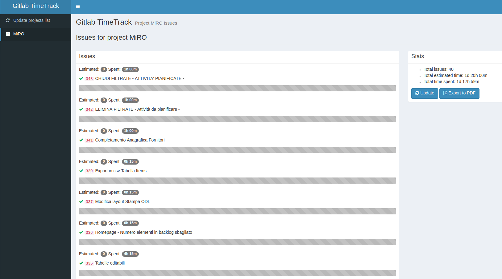

Gitlab Timetrack
================

A Symfony project to display time track info from Gitlab Projects



Installation
------------

Install from packagist (still in development stage)

`composer.phar create-project lucasaba/gitlab-time-track.git -s dev`

You'll have to provide some information:

* database_host (127.0.0.1): 
* database_port (null): 
* database_name (symfony): 
* database_user (root): 
* database_password (null): 
* secret (ThisTokenIsNotSoSecretChangeIt): 
* gitlab_token (yourSuperSecretGitlabToken): 
* gitlab_server_url ('https://your.gitlab.server.host/api/v4'):

The gitlab token can be obteined in `https://your.gitlab.server.host/profile/personal_access_tokens` 

Enter in the project folder
```bash
cd gitlab-time-track.git
```
Create the database and the schema

```bash
user@server:/path/to/gitlab-timetrack-project$ php bin/console doctrine:database:create
user@server:/path/to/gitlab-timetrack-project$ php bin/console doctrine:schema:create

```

If you don't want to configure your personal web server, just start the php web server:

```bash
user@server:/path/to/gitlab-timetrack-project$ php bin/console server:start

```

Head to [http://localhost:8000](http://localhost:8000)

That's all!